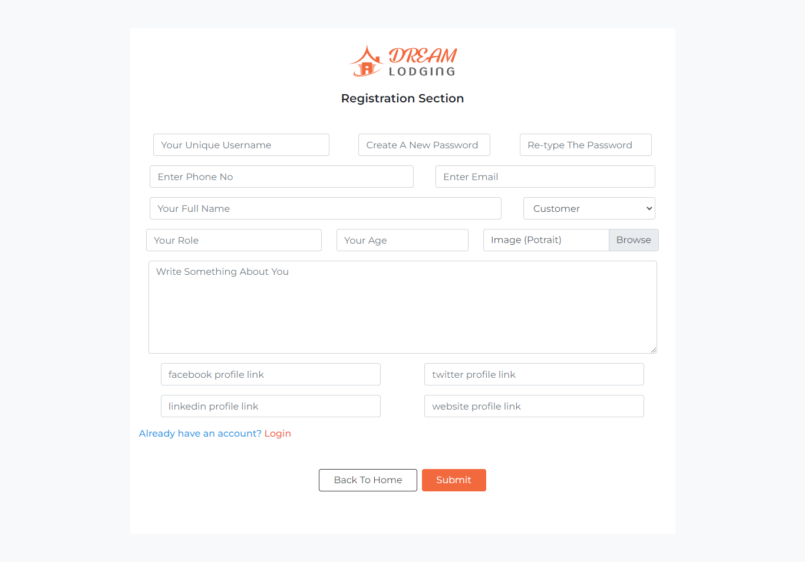
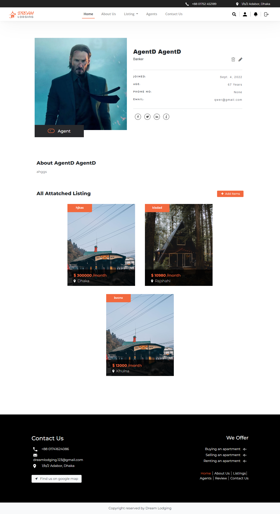

## Dream Housing


House rent system built using Django framework.


## Installation 

Python and Django need to be installed

```bash
    pip install django
```
### Image Load Command 
```bash
    pip install pillow
```
## Running the project Locally

First clone the repository to your local machine:

```bash
    gitclone https://github.com/Kanchon-Gharami/Dream_Housing/tree/main/FullStack
```

## Create Database

First Ensure command 
```bash
    python manage.py makemigrations
```
Second command
```bash
    python manage.py migrate
```

## Create Superuser
```bash
    python manage.py createsuperuser
```
## Run the development server
```bash
    python manage.py runserver
```
Then go to the browser and enter the url
```bash
    http://127.0.0.1:8000/
```
 
 ## Users
 <p>Rent System  is intended for interaction among three users -</p>
 1. Superuser <br/>
 2. Agent <br/>
 3. Customer 

 Fill out the registration form if the agent and the customer are not registered.


 Admin ensures only Agent's consent.
<image src="Readme_img/Admin.png"/>
 Click "add items" then Agent add apartment detials and provide the necessary information.

<image src="Readme_img/Apartment.png"/>
 Customer chooses an apartment on the listing page.
<image src="Readme_img/Listing.png"/>
 The customer notifies the agent of their desire, and if the agent agrees, the customer visits the flat or makes a reservation.
<image src="Readme_img/requestednotification.png"/>
<p>After Customer Reqest Agent approval</p>
<image src="Readme_img/ApproveNotification.png"/> 
<p>Customer page with granted request</p>
<image src="Readme_img/Customer.png"/>
 Booked item remove from Listing. 

